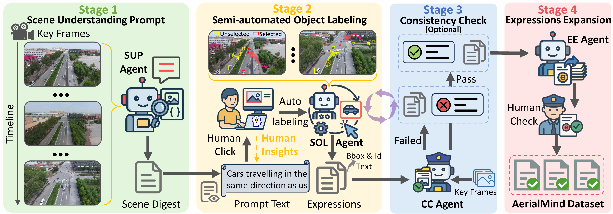
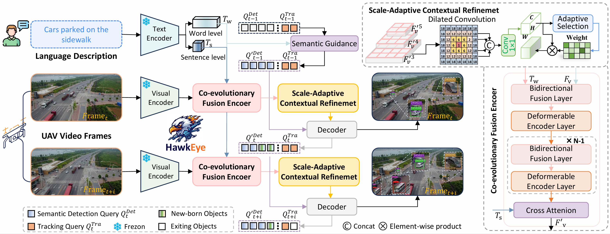
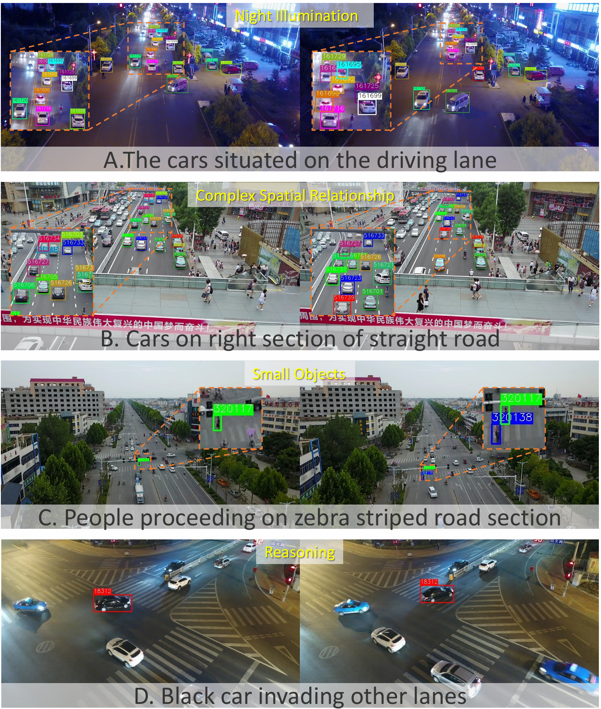

# AerialMind: Towards Referring Multi-Object Tracking in UAV Scenarios

This official repository of the paper [AerialMind: Towards Referring Multi-Object Tracking in UAV Scenarios](). 
<div align=center></div>

# Abstract
Referring Multi-Object Tracking (RMOT) aims to achieve precise target detection and tracking through natural language instructions. While existing RMOT methods have demonstrated promising results in ground-level scenarios, they fundamentally lack the capability to address the unique challenges inherent in aerial perspectives. The dramatic scale variations, complex spatial relationships, and dynamic viewpoint changes in it lead to the limited generalization ability of these methods in real-world applications. Consequently, we introduce AerialMind, the first large-scale RMOT benchmark in Unmanned Aerial Vehicle (UAV) scenarios, which aims to bridge this research gap.  To facilitate its construction, we developed COALA, a novel semi-automated collaborative agent-based labeling assistant framework that significantly reduces labor costs while maintaining annotation quality. Furthermore, we propose HawkEyeTrack (HETrack), a novel tracking method that synergistically vision-language representation learning and enhances the perception of small-scale objects. Comprehensive experiments validated the challenge of our dataset and the effectiveness of our method. The dataset and code will be publicly at here.

# Dataset Features and Statistics
| Dataset        | Source       | Videos | Dom. | Reas. | Attr. | Expressions | Words | Instance / Expression | Instance | Annobbox  |
|----------------|--------------|--------|------|-------|-------|-------------|-------|-----------------------|----------|-----------|
| Refer-KITTI    | CVPR2023     | 18     | ✗    | ✗     | ✗     | 818         | 49    | 10.7                  | 8.8K     | 0.36M     |
| Refer-Dance    | CVPR2024     | 65     | ✗    | ✗     | ✗     | 1.9K        | 25    | 0.33                  | 650      | 0.55M     |
| Refer-KITTI-V2 | arXiv2024    | 21     | ✗    | ✗     | ✗     | 9.8K        | 617   | 6.7                   | 65.4K    | 3.06M     |
| Refer-UE-City  | arXiv2024    | 12     | ✗    | ✗     | ✗     | 714         | --    | 10.3                  | --       | 0.55M     |
| Refer-BDD      | IEEE TIM2025 | 50     | ✗    | ✗     | ✗     | 4.6K        | 225   | 14.1                  | 70.4K    | 1.50M     |
| CRTrack        | AAAI2025     | 41     | ✓    | ✗     | ✗     | 344         | 43    | --                    | --       | --        |
| LaMOT*         | IEEE ICRA2025| 62     | ✗    | ✗     | ✗     | 145         | 9     | **54.6**              | 508      | 1.2M      |
| AerialMind     | Ours         | **93** | ✓    | ✓     | ✓     | **24.6K**   | **1.2K** | 11.9              | **293.1K** | **46.14M** |

<div align=center></div>


# Method
<div align=center></div>
Overview of the four-stage annotation process in the COALA framework. This framework efficiently constructs the AerialMind dataset through multi-agent collaboration and human-computer interaction.
<div align=center></div>
Overview of the HawkEyeTrack.

# Results
## Visualization
<div align=center></div>

# Getting started
## Data Preparation
Put the tracking datasets in ./data. It should look like:
   ```
   ${PROJECT_ROOT}
    -- data
        --  AerialMind
            |-- Attribute
            |-- image_02
                 -- Visdrone
                 -- UAVDT
            |-- labels_with_ids
   ```

## Installation

* Linux, CUDA>=9.2, GCC>=5.4
  
* Python>=3.7

    We recommend you to use Anaconda to create a conda environment:
    ```bash
    conda create -n deformable_detr python=3.7 pip
    ```
    Then, activate the environment:
    ```bash
    conda activate deformable_detr
    ```
  
* PyTorch>=1.5.1, torchvision>=0.6.1 (following instructions [here](https://pytorch.org/))

    For example, if your CUDA version is 9.2, you could install pytorch and torchvision as following:
    ```bash
    conda install pytorch=1.5.1 torchvision=0.6.1 cudatoolkit=9.2 -c pytorch
    ```
  
* Other requirements
    ```bash
    pip install -r requirements.txt
    ```

* Build MultiScaleDeformableAttention
    ```bash
    cd ./models/ops
    sh ./make.sh
    ```

# TODO List

- [x] release the dataset [Train]
- [ ] release the dataset [Test]
- [ ] release the code
